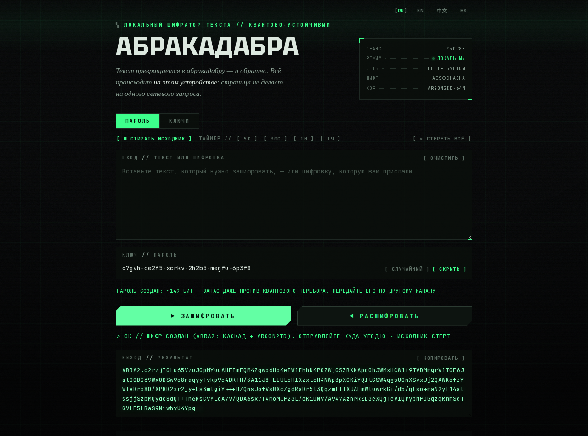
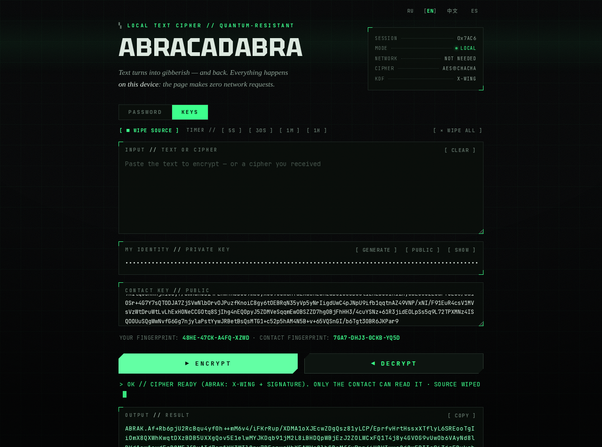
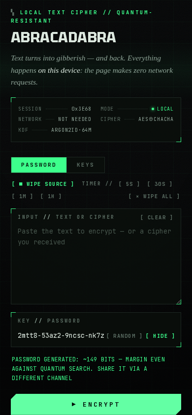

<div align="center">

# ✳ ABRACADABRA

**Offline, single-file text cipher. Paste text → get gibberish → send it anywhere.**
*Quantum-resistant. No accounts, no servers, no network requests — ever.*

[English](#english) · [Русский](#русский)


<br>

### 🚀 [Открыть онлайн / Open the app](https://anic888.github.io/abracadabra/) &nbsp;·&nbsp; ⬇️ [Скачать файл / Download](https://github.com/Anic888/abracadabra/releases/latest/download/abracadabra.html)

*Онлайн и скачанный файл — одно и то же приложение: всё считается на вашем устройстве, в сеть ничего не уходит.*
*The online and downloaded versions are the same app: everything runs on your device, nothing touches the network.*

📱 *С телефона: откройте ссылку → «Добавить на экран „Домой“» — установится как приложение и дальше работает офлайн (PWA).*
📱 *On mobile: open the link → “Add to Home Screen” — it installs as an app and keeps working fully offline (PWA).*

<br>



</div>

---

## English

### What is this?

You want to send a private note through a channel you don't fully trust — a paste service, a messenger, email. **Abracadabra** turns your text into an encrypted blob (`ABRA2.xK9f…`) right in your browser. The service in the middle sees only gibberish. The recipient opens the same file, enters the password (or their key), and reads the original.

The whole app is **one HTML file**. Download it, double-click it, done. It works with Wi-Fi off — there is literally no code in it that talks to the network. Send the file itself to your contact; it contains no secrets.

### Quick start

1. [**Open the app online**](https://anic888.github.io/abracadabra/) — or [**download `abracadabra.html`**](https://github.com/Anic888/abracadabra/releases/latest/download/abracadabra.html) and open it in any modern browser (works fully offline).
2. Paste your text, set a password — your own or the built-in generator (`[ RANDOM ]`, ~149 bits).
3. **Encrypt** → copy the `ABRA2.…` gibberish → send it through anything.
4. Your contact opens the same file, pastes the blob, enters the same password → **Decrypt**.
5. Share the password through a *different* channel (voice is best). Or skip shared passwords entirely — see **Keys mode**.
6. **Panic hygiene:** the source text auto-wipes after encryption (toggleable), a timer (5 s / 30 s / 1 m / 1 h) can wipe everything on countdown, and `[ × WIPE ALL ]` — or double-press <kbd>Esc</kbd> — instantly clears text, password, keys, result and the clipboard.

<div align="center">
<table>
<tr>
<td align="center" width="33%"><h3>🔌 Offline by design</h3>Zero network requests. Open the file in an editor and check — it's all there, readable.</td>
<td align="center" width="33%"><h3>🧅 Cascade cipher</h3>ChaCha20 inside, AES-256-GCM outside, independent keys via HKDF. Breaking it means breaking <i>both</i>.</td>
<td align="center" width="33%"><h3>⚛️ Quantum-aware</h3>No classical asymmetry to Shor. Grover vs AES-256 leaves 128 bits. Keys mode uses post-quantum ML-KEM-768.</td>
</tr>
<tr>
<td align="center"><h3>🔑 Two modes</h3><b>Password</b>: Argon2id (64 MiB) makes GPU cracking hit a memory wall. <b>Keys</b>: no shared secret at all.</td>
<td align="center"><h3>🕵️ Length hiding</h3>Ciphertext is padded to buckets — "yes" and a full paragraph look identical in size.</td>
<td align="center"><h3>🌍 4 languages</h3>Russian, English, 中文, Español — auto-detected. Ciphers are compatible across languages and versions.</td>
</tr>
</table>
</div>

### Keys mode — no shared password

Each side presses `[ GENERATE ]` **once**: you get a private key (`ABRAKPRV…`, keep it secret) and a public key (`ABRAKPUB…`, give it away freely). Exchange public keys once — from then on, nothing secret ever needs to travel.

- **Send:** your private + their public → only they can read it.
- **Receive:** your private → the app shows the **sender's fingerprint** (e.g. `SCRZ-WWB2-GKRE-DEDG`); paste the sender's public key and it says `✓ VERIFIED`. Compare fingerprints by voice once — a swapped key becomes obvious.
- Key exchange is **X-Wing** (ML-KEM-768 + X25519) — the same hybrid post-quantum approach as Signal's PQXDH: a quantum computer would have to defeat *both halves*. Sender authentication is an Ed25519 signature. Every message uses a fresh ephemeral encapsulation, so compromising the sender later doesn't unlock past intercepted messages.

<div align="center">

&nbsp;

</div>

### Formats

| Format | Key derivation | Cipher | Extras |
|---|---|---|---|
| `ABRA2.` (password) | Argon2id · 64 MiB · t=3, or 256 MiB · t=4 on the paranoid profile | AES-256-GCM ⊕ ChaCha20 cascade | KDF parameters recorded in the header, bucket padding, NFC-normalized passwords |
| `ABRAK.` (keys, v2) | X-Wing = ML-KEM-768 + X25519 → HKDF, **sender bound into the key** | same cascade | Ed25519 sender signature, fingerprints |
| `ABRAM.` (keys, many) | one random key per message, wrapped separately per recipient | same cascade | up to 32 recipients, recipient list not recoverable from the message |
| `.abra` v2 (files) | as above, per container | framed: 4 MiB frames, each AEAD-sealed | signature over a SHA-256 chain of frames, key commitment, true length encrypted |
| `ABRA1.` (legacy) | PBKDF2-SHA-256 · 600k | AES-256-GCM | still decrypts, no longer produced |
| `ABRAK.` v1, `.abra` v1 | legacy | legacy | still decrypt, **but their sender can be forged** — the app says so and never shows them as verified |

Older formats stay readable. **New ones do not go backwards:** ciphertexts and
containers written by 5.1 need 5.1 or newer on both ends, and public keys must be
regenerated once — see [CHANGELOG.md](CHANGELOG.md).

### What it protects against — and what it doesn't

**Protects:** the transport channel (paste sites, messengers, email providers, network observers) reading your text; tampering (authenticated encryption — a modified blob is rejected, never silently corrupted); offline brute-force of decent passwords (Argon2id memory-hardness); "harvest now, decrypt later" quantum attacks in keys mode (hybrid PQ KEM).

**Does not protect:** a compromised device on either end (malware/keyloggers see everything before encryption); a weak guessable password; metadata (who sent what to whom, when, and roughly how much — padding only rounds the size); a tampered copy of the tool itself (get the file from a source you trust and compare checksums).

**Honest notes:** the Ed25519 signature is classical — sender *authenticity* is protected against today's attackers, while *confidentiality* is what carries the post-quantum guarantee. Password mode has no forward secrecy (one password unlocks all messages encrypted with it) — keys mode is the answer. This tool has **not** undergone an independent security audit.

### Verification

- **Press `[ SELF-TEST ]` at the bottom of the app.** It runs 77 checks in about
  12 seconds, in your own browser: published vectors for ChaCha20 (RFC 8439 §2.4.2),
  Argon2id (RFC 9106 §5.3), X-Wing and Ed25519; ciphertexts produced by version 5.0;
  and forgery attempts that must each be rejected. If your browser computes something
  wrong, you find out before you trust the tool with something that matters.
- **Open devtools → Network and use the app.** There should be no requests. This is
  enforced by the page's own `Content-Security-Policy` (`connect-src 'none'`), not by
  a promise: measured against a local server, of thirteen exfiltration channels
  (fetch, XHR, sendBeacon, images, CSS, script, iframe, prefetch, object, video,
  WebSocket, EventSource, form submission) all thirteen are blocked.
- **Read the code.** Open `index.html` in an editor — the application code is readable
  and commented; vendored crypto libraries are embedded minified with sources linked below.

### Checksum — is this the real file?

The tool is a single HTML file that travels by email, chat and USB stick. Nothing
inside a page can prove that page has not been rewritten, so the check has to come
from outside it. Current `index.html`:

`bba97aaa54d59034f12cdd67626e27cfaa3b0bd130c770b83ba1dd3089d1beb5`

```bash
shasum -a 256 index.html          # macOS
sha256sum index.html              # Linux
certutil -hashfile index.html SHA256   # Windows (cmd)
```

**This only helps if the file and the number reach you by different routes.** Take the
file from wherever it came — a friend, an attachment, a stick — and read the number
here, over HTTPS, from the repository. If they disagree, the copy you hold is not the
one that was published. Reading both off the same medium proves nothing: whoever
altered the file would alter the number next to it.

A checksum printed *inside* the app would be theatre for the same reason, which is why
there isn't one. The number lives here, and `./checksum.sh` re-derives it so a stale
value can never be published — a wrong checksum is worse than none, because it makes an
honest copy look forged.
- Threat model and honest limits: **[SECURITY.md](SECURITY.md)**.

The design review, the pentest suite (45 executable exploits), the known-answer
vectors and the previous build kept for regression testing are all retained
privately, not published — running attack code is not something to hand out.

---

## Русский

### Что это?

Нужно передать приватный текст через канал, которому вы не до конца доверяете — Privnote, мессенджер, почту. **Абракадабра** превращает текст в шифровку (`ABRA2.xK9f…`) прямо в браузере. Сервис посередине видит только мусор. Получатель открывает такой же файл, вводит пароль (или свой ключ) — и читает оригинал.

Всё приложение — **один HTML-файл**. Скачали, открыли двойным кликом — работает. Интернет не нужен вообще: в файле физически нет кода, который ходит в сеть. Сам файл можно свободно переслать собеседнику — секретов в нём нет.

### Быстрый старт

1. [**Откройте онлайн**](https://anic888.github.io/abracadabra/) — или [**скачайте `abracadabra.html`**](https://github.com/Anic888/abracadabra/releases/latest/download/abracadabra.html) и откройте в любом браузере (работает полностью офлайн).
2. Вставьте текст, задайте пароль — свой или из генератора (`[ СЛУЧАЙНЫЙ ]`, ~149 бит).
3. **Зашифровать** → скопируйте абракадабру `ABRA2.…` → отправляйте чем угодно.
4. Собеседник открывает такой же файл, вставляет шифровку, вводит тот же пароль → **Расшифровать**.
5. Пароль передавайте по *другому* каналу (лучше всего голосом). Либо вообще без общего пароля — режим **«Ключи»**.
6. **Экстренная гигиена:** исходник сам стирается после шифрования (отключаемо), таймер (5 с / 30 с / 1 м / 1 ч) стирает всё по отсчёту, а `[ × СТЕРЕТЬ ВСЁ ]` — или двойной <kbd>Esc</kbd> — мгновенно чистит текст, пароль, ключи, результат и буфер обмена.

### Режим «Ключи» — без общего пароля

Каждый **один раз** жмёт `[ СОЗДАТЬ ]`: приватный ключ (`ABRAKPRV…`) храните в секрете, публичный (`ABRAKPUB…`) отдаёте свободно. Обменялись публичными — и больше ничего секретного передавать не нужно.

- **Отправка:** ваш приватный + публичный собеседника → прочитает только он.
- **Приём:** ваш приватный → приложение показывает **отпечаток отправителя**; вставьте его публичный ключ — появится `✓ ПОДТВЕРЖДЁН`. Отпечатки один раз сверьте голосом — подмена ключа станет очевидной.
- Обмен ключами — **X-Wing** (ML-KEM-768 + X25519), тот же гибридный постквантовый подход, что в Signal PQXDH: квантовому компьютеру пришлось бы пробить *обе половины*. Подпись отправителя — Ed25519. Каждое сообщение шифруется свежей эфемерной инкапсуляцией: компрометация отправителя потом не раскрывает перехваченное раньше.

### От чего защищает — и от чего нет

**Защищает:** от чтения текста каналом передачи (сервисы заметок, мессенджеры, почта, наблюдатели сети); от подмены (аутентифицированное шифрование — изменённая шифровка отклоняется); от оффлайн-перебора нормальных паролей (Argon2id упирает перебор в память); от «перехватить сейчас — расшифровать потом» квантовых атак в режиме ключей.

**Не защищает:** от заражённого устройства с любой стороны; от слабого угадываемого пароля; от метаданных (кто, кому, когда и примерно сколько — паддинг лишь округляет размер); от подменённой копии самого инструмента (берите файл из доверенного источника, сверяйте хэш).

**Честно:** подпись Ed25519 — классическая: аутентичность защищена от сегодняшних атак, а постквантовая гарантия относится к конфиденциальности. В парольном режиме нет forward secrecy (один пароль открывает всё, что им зашифровано) — на это отвечает режим ключей. Независимого аудита безопасности **не было**.

### Проверки

Кнопка `[ САМОТЕСТ ]` внизу страницы прогоняет **101 проверку** прямо в вашем
браузере: контрольные векторы ChaCha20 (RFC 8439), Argon2id (RFC 9106), X-Wing и
Ed25519; шифровки, созданные версией 5.0; и попытки подделки, каждая из которых
обязана быть отвергнута. Каждая такая попытка — реальная найденная дыра,
поставленная на дежурство, чтобы не вернуться.

Откройте инструменты разработчика → «Сеть» и поработайте с программой: запросов
быть не должно. Это обеспечивает политика самой страницы (`connect-src 'none'`), а
не обещание в тексте — из тринадцати проверенных каналов утечки заблокированы все
тринадцать. Сам код читаемый и с комментариями — откройте `index.html` в редакторе.

### Контрольная сумма — тот ли это файл?

Программа — один HTML-файл, который ходит по почте, мессенджерам и флешкам. Ничто
внутри страницы не может доказать, что страницу не переписали, поэтому проверка
обязана прийти **снаружи**. Текущий `index.html`:

`bba97aaa54d59034f12cdd67626e27cfaa3b0bd130c770b83ba1dd3089d1beb5`

```bash
shasum -a 256 index.html          # macOS
sha256sum index.html              # Linux
certutil -hashfile index.html SHA256   # Windows (cmd)
```

**Это работает, только если файл и число пришли к вам разными путями.** Файл
берите откуда взяли — от знакомого, из вложения, с флешки, — а число читайте
здесь, по HTTPS, из репозитория. Не сошлось — у вас не тот файл, что публиковали.
Сверять то и другое с одного носителя бессмысленно: кто подменил файл, подменит и
число рядом с ним.

Сумма, напечатанная **внутри** приложения, была бы по той же причине театром —
поэтому её там и нет. Число живёт здесь, а `./checksum.sh` его пересчитывает,
чтобы нельзя было опубликовать протухшее: неверная сумма хуже отсутствующей, она
заставляет честную копию выглядеть подделкой.

---

## Third-party / Встроенные компоненты

Vendored (embedded into the single file) with gratitude:

| Component | Author | License |
|---|---|---|
| [noble-post-quantum](https://github.com/paulmillr/noble-post-quantum), [noble-curves](https://github.com/paulmillr/noble-curves), [noble-hashes](https://github.com/paulmillr/noble-hashes) | Paul Miller | MIT |
| [argon2-browser](https://github.com/antelle/argon2-browser) (WASM) | Antelle | MIT |
| [JetBrains Mono](https://github.com/JetBrains/JetBrainsMono) (subset) | JetBrains | OFL-1.1 |
| [Tektur](https://fonts.google.com/specimen/Tektur) (subset) | Adam Ladd | OFL-1.1 |

See [THIRD_PARTY.md](THIRD_PARTY.md) for license texts. Application code: [MIT](LICENSE).

**Disclaimer:** provided as-is, without warranty of any kind. Cryptography follows well-known standards (RFC 8439, RFC 9106, FIPS 203, X-Wing draft), but no independent audit has been performed. Don't bet lives on it.

</div>
